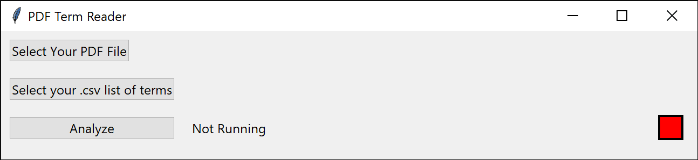
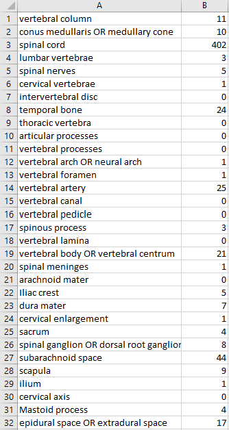

# PDF Term Search Tool

## Intro

This is the PDF-Term-Search Tool designed by Daniel Gibbons at the New York Institute of Technology College of Osteopathic Medicine Anatomy Department, utilizing the Python programming language.  
This tool has been designed to determine the frequencies of multiple terms in a PDF file with minimal user input.
All that is required are two files: A .csv file containing the terms to be identified, and the .pdf file to parse through.

## Use

To use the PDF-Term-Search Tool, use the following instructions:

### Setup

1. Navigate to https://github.com/degibbons/PDF-Term-Search
2. Select the "Code" button dropdown towards the top of the page, just above the files included in this package.
3. Select "Download ZIP" on the dropdown, and you should be prompted to save a zip file anywhere on your file system.
4. Navigate to the saved zip file and extract its contents using any zip/unzip application such as 7zip, or Windows' built in compressed folder tools.
5. Navigate to the newly extracted files, and run the PDFtermsearch.exe file by either double clicking the file itself or opening up a terminal within the current file tree and running the program from there.

### Operation

1. After the file has been opened, you'll be presented with a GUI (Graphical User Interface) similar to the one below. The window may be resized to fit elements that may not fit within the window immediately.
   
2. Click 'Select Your PDF File' to open a file manager box.
   a. Navigate to the PDF file you wish to parse for a predefined set of terms.
   b. Select the file.
   c. Click Open.
3. Click 'Select your .csv list of terms' to open another file manager box.
   a. Just like step 2, navigate to the file that lists the terms you are searching for.
   b. Select the file.
   c. Click Open.
4. Select 'Analyze'.

### Output

Depending on the size of the .pdf file to parse and the number of separate terms in the input .csv, the program can and very well may hang for several seconds, minutes, or even hours.
Once the program is finished running, the text indicator next to the 'Analyze' button will read "Finished" and the box in the lower right-hand corner will turn green, indicating parsing is finished and an output file generated.
The output files will be placed in the same location as the unzipped .exe file. The output will be named ResultsOut.csv, much in the same format as the in-terms file. The first column will contain the original input terms in the same order as the original input .csv, but a second column will now be present, displaying a number for each term corresponding with the amount of times the term has been identified in the parsed pdf.
For an example, see below:

## Details

### Term Input Format

The format of the input .csv file is simply one column of terms, as below:

Terms that are considered synonyms can be grouped together using a capital "OR" with a space before and after OR. Up to 10 terms may be grouped together. The final tally for each group will not report all the joined terms separately, but rather all together.

### PDF Notes of Interest

This program utilizes PyPDF2 to read and parse available text in a given .pdf file. If the text is within a side bar or unusual place, such as a diagram, it is possible that the library-provided PdfFileReader object may not pick up the aforementioned text.
.pdf files selected should have the intended parsable text within the regular defined bounds. Essentially, although a .pdf file may contain sidebars, image captions, image text, illustrative chapter titles, and other text that does not fall within the main body, these should not be the intended target for parsing using this tool, as there is no guarantee the text itself will be identified for parsing.
The PyPDF2 library that allows for parsing only extracts clearly identifiable text, essentially, what can be highlighted on the document when viewing.
Users should be wary of this behavior before running the program.

## Acknowledgments

This program was created to support a research project by Dr. Jonathan Geisler, Chair and Associate Professor of the NYIT Department of Anatomy in the College of Osteopathic Medicine.
